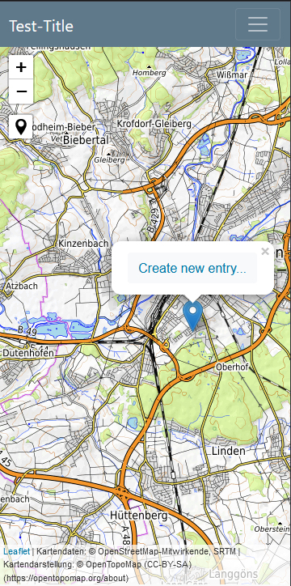
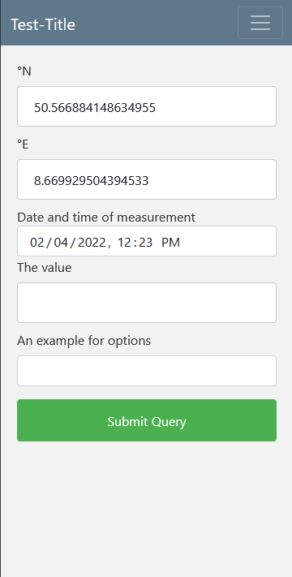

# Spatial Citizen Science

 

## A simple web app to enable spatial data collection for citizens

This web app is designed for research institutions to engage citizens in the collection of spatial data. 
It aims to be usuable without programming knowledge. 

This is a simple highly configurable mobile web app based on Python / [Flask](https://palletsprojects.com/p/flask/).

It has a map view with the possiblilty to create entries by the users

### Screen shots
 

## Installation

### At the operation system level

 You need access to a system with the following:

- Python 3.8 or higher (enough for testing)
- A [WSGI server](https://flask.palletsprojects.com/en/2.0.x/deploying/wsgi-standalone/) to serve the web app
- A reverse proxy with ssl, eg. nginx, apache

### In a container (recommended)

The simplest way is to install the app in a Docker container. Relevant files together with an example app [can be found
here](https://github.com/jlu-ilr-hydro/spatialcitizenscience-docker). 

